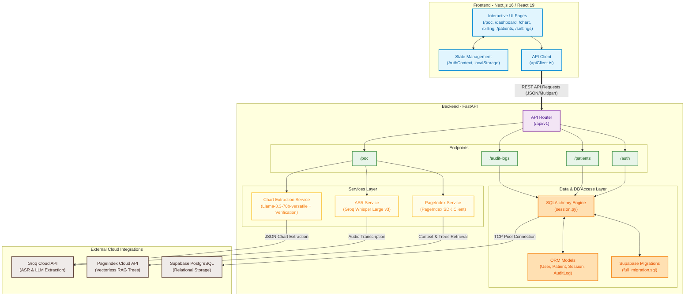

# DentalScribeAI 🦷

AI-powered dental transcription, real-time periodontal charting, and automated billing assistant with vectorless RAG context linking and HIPAA-compliant audit trails.

---

## 🏗️ System Architecture

The following diagram illustrates the end-to-end architecture of DentalScribeAI, including the relationship between the Next.js frontend client, the FastAPI backend services, the relational storage, and the external cloud API integrations.



---

## 🌟 Core Features

1. **AI Dental Transcription (ASR)**: Voice recording is processed by Groq's Whisper API with a custom medical vocabulary prompt, ensuring dental jargon (CDT codes, surfaces, arches) is accurately transcribed.
2. **Vectorless RAG (PageIndex)**: Traverses your hierarchical dental knowledge document index dynamically to match clinical context and fetch traversal pathways.
3. **Smart Chart Extraction**: Converts transcript text into structured clinical findings (tooth number, surface, confidence) with verbatim quote validation (prevents LLM hallucinations by mapping exact offsets in the transcript).
4. **Interactive Dental Workspaces**:
   - **Perio Charting Editor**: Interactive Maxillary (Upper) and Mandibular (Lower) teeth arches for pockets depths (1mm - 10mm limits) and Bleeding on Probing (BOP) checkbox controls with real-time sync.
   - **Citation Workspace**: Split-panel workspace where hovering over extracted chart findings highlights the exact supporting sentence in the transcript, and vice versa.
   - **Billing & CDT Codes**: Automatically maps findings to CDT codes (e.g. D1330, D4910), flags underbilled procedures, and allows editing code list and totals before insurance claims.
5. **HIPAA Compliance & Security**: Built-in encrypted access audit logging tracking all credentials, profile changes, patient accesses, settings updates, and claims submissions.

---

## 🛠️ Tech Stack

- **Frontend**: Next.js 16 (React 19), TypeScript, Vanilla CSS Design System.
- **Backend**: FastAPI (Python), SQLAlchemy, PageIndex Python SDK, Groq Python SDK.
- **Database**: Supabase PostgreSQL.
- **Testing**: Vitest (Frontend), Pytest (Backend).

---

## 📂 Project Structure

```
DentalScribeAI/
├── backend/
│   ├── app/
│   │   ├── api/v1/          # FastAPI routes (auth, patients, poc, audit_logs)
│   │   ├── core/            # Config settings and dependencies
│   │   ├── db/              # SQLAlchemy session initialization
│   │   ├── models/          # ORM models (User, Patient, Session, AuditLog)
│   │   ├── schemas/         # Pydantic schemas (User, Patient, Session, AuditLog)
│   │   ├── services/        # ASR, PageIndex RAG, and LLM Extraction services
│   │   └── main.py          # App entrypoint & DB connection verified lifespan
│   ├── tests/               # Pytest directories (unit, integration)
│   ├── requirements.txt     # Python backend dependencies
│   └── Dockerfile           # Backend container instructions
├── frontend/
│   ├── src/
│   │   ├── __tests__/       # Comprehensive Vitest suite (LoginPage, Dashboard, Chart, etc.)
│   │   ├── app/             # Next.js App Router pages (/poc, /dashboard, /settings)
│   │   ├── components/      # Feature panels (CitationWorkspace, PageIndexPanel, TopBar)
│   │   ├── lib/             # API client methods (authApi, patientsApi, logsApi)
│   │   └── store/           # Global React Contexts (AuthContext)
│   ├── package.json         # Scripts, React 19 dependencies, and Vitest setup
│   ├── vitest.config.ts     # Vitest environment configurations (jsdom)
│   └── Dockerfile           # Frontend container instructions
├── supabase/
│   └── full_migration.sql   # Database schemas, constraints, and initial seeds
├── docker-compose.yml       # Docker orchestrator for development
└── README.md
```

---

## 🚀 Setup & Installation

### Prerequisites
- Python 3.10+ (via Miniconda or Anaconda is recommended)
- Node.js 18+
- Docker & Docker Compose (optional)

### 1. Database Setup (Supabase)
1. Create a project on [Supabase](https://supabase.com/).
2. Navigate to **SQL Editor** in your Supabase dashboard and run the contents of [supabase/full_migration.sql](file:///d:/DentalScribeAI/supabase/full_migration.sql) to set up tables (`users`, `patients`, `sessions`, `chart_entries`, `billing_codes`, `hipaa_audit_logs`) and populate the initial dental practice profile and patient database.

---

### 2. Backend Installation (FastAPI)

1. Open your terminal and navigate to the backend directory:
   ```bash
   cd backend
   ```
2. Create and activate a virtual environment:
   ```bash
   # Windows (Command Prompt)
   python -m venv venv
   venv\Scripts\activate

   # Windows (Powershell / Miniconda)
   conda create -n dentalscribe python=3.10
   conda activate dentalscribe
   ```
3. Install dependencies:
   ```bash
   pip install -r requirements.txt
   ```
4. Copy the environment template and configure your secrets:
   ```bash
   cp .env.example .env
   ```
   Open `.env` and fill in:
   - `DATABASE_URL` (Supabase Transaction Pooler URL)
   - `GROQ_API_KEY` (Get from [Groq Console](https://console.groq.com/))
   - `PAGEINDEX_API_KEY` & `PAGEINDEX_DOC_ID` (Get from [PageIndex](https://dash.pageindex.ai/))
5. Launch the backend development server:
   ```bash
   uvicorn app.main:app --reload
   ```
   *The backend will run on [http://localhost:8000](http://localhost:8000). Interactive OpenAPI documentation is accessible at [http://localhost:8000/docs](http://localhost:8000/docs).*

---

### 3. Frontend Installation (Next.js)

1. Navigate to the frontend directory:
   ```bash
   cd ../frontend
   ```
2. Install Node modules:
   ```bash
   npm install
   ```
3. Copy environment template and verify your API route:
   ```bash
   cp .env.local .env.local
   ```
   Ensure `NEXT_PUBLIC_API_URL` is pointing to your backend endpoint (default is `http://localhost:8000/api/v1`).
4. Launch the frontend development server:
   ```bash
   npm run dev
   ```
   *The client will run on [http://localhost:3000](http://localhost:3000).*

---

## 🧪 Running Tests

### Frontend (Vitest)
A rigorous, stateful test suite validates user flows, forms, pocket limits, citation highlighting, billing code calculations, settings log modals, and global search.

To execute the test suite:
```bash
cd frontend
npm run test
```

### Production Build Verification
To ensure all TypeScript typings and Next.js static pages optimize successfully:
```bash
cd frontend
npm run build
```

---

## 🐳 Docker Deployment

To build and run both the Next.js frontend and FastAPI backend inside a unified environment:
```bash
docker-compose up --build
```
- Frontend UI is accessible at [http://localhost:3000](http://localhost:3000)
- Backend Swagger docs are accessible at [http://localhost:8000/docs](http://localhost:8000/docs)
