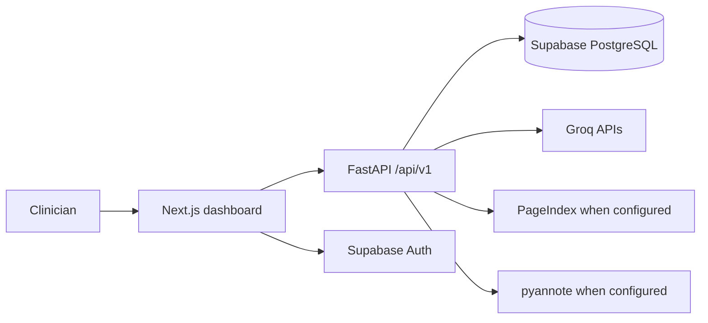

# DentalScribeAI

**AI assisted dental visit documentation and clinical review**

DentalScribeAI is an end of internship full stack project connecting a Next.js practice dashboard to a FastAPI processing pipeline. A clinician can manage patients, record visits, review speaker labeled transcripts, inspect evidence for extracted findings, edit charts, and confirm procedure codes. The application also provides visit notes, follow up drafts, patient summaries, risk flags, analytics, and audit history.

> **Clinical use:** AI output is a draft for professional review. A qualified clinician must verify findings, notes, and codes before use in care or billing. Access controls and audit features alone do not establish HIPAA compliance.

## Technology

| Layer | Stack |
| --- | --- |
| Frontend | Next.js 16, React 19, TypeScript, CSS |
| API | FastAPI, Pydantic, SQLAlchemy |
| Identity and data | Supabase Auth and PostgreSQL |
| AI | Groq speech recognition and language model APIs |
| Optional context | PageIndex document queries |
| Optional diarization | pyannote.audio, Hugging Face, FFmpeg |
| Tests | Vitest, React Testing Library, pytest, FastAPI TestClient |
| Deployment configuration | Vercel frontend; Render or Docker backend |

## Features

- **Patient and visit management:** Create and search patients, view visit history, and start a recording for a selected patient.
- **Audio processing:** Upload audio to a background job, transcribe speech, and label dentist and patient turns. Reviewers can swap incorrect speaker labels.
- **Evidence linked extraction:** Extract clinical findings with supporting transcript excerpts and offsets, validate tooth numbers, and process long transcripts in chunks.
- **Clinical review:** Edit chart entries, generate a visit note, review medication and allergy information and risk flags, compare visits, and prepare follow up and patient summary drafts.
- **Coding and billing:** Search a CDT catalog, inspect suggested procedures, confirm or edit codes, and review billing details.
- **Practice oversight:** Dashboard statistics, review tasks, analytics, settings, audit logs, and session timeline.
- **Standalone review:** The `/review` workspace supports demo transcript, transcription, PageIndex queries, and chart extraction.

## Architecture



Backend routes live in `backend/app/api/v1/endpoints`; processing lives in `backend/app/services`; models and database access live in `backend/app/models` and `backend/app/db`. The frontend uses the Next.js App Router and a shared API client. Protected backend routes scope data access to the user's practice.

## Repository structure

```text
backend/
  app/api/v1/endpoints/   Auth, patients, transcription, notes, review, workflow, audit logs
  app/services/           Speech, diarization, extraction, coding, notes, summaries
  app/core/               Settings and authentication dependencies
  app/db/, app/models/    Database connection and ORM models
  app/schemas/            Request and response schemas
  tests/                  Backend tests
  .env.example            Backend environment template
  render.yaml             Render service definition
frontend/
  src/app/                Login, dashboard, recording, chart, billing, patients, review
  src/components/         Layout, authentication and evidence review
  src/lib/                API and Supabase clients
  src/store/              Authentication context
  src/__tests__/          Frontend UI tests
supabase/
  migrations/             Ordered schema and feature migrations
  full_migration.sql      Initial consolidated schema and demo data
docs/                    Deployment, commands, context and planning notes
docker-compose.yml       Local service outline
```

## Local setup

### Prerequisites

- Python 3.11 and Node.js/npm compatible with Next.js 16
- A Supabase project with PostgreSQL and Auth
- Groq credentials for transcription and extraction
- Optional: PageIndex credentials for document context
- Optional: FFmpeg, a Hugging Face token, and accepted pyannote model licenses for audio diarization

### 1. Database

Apply the SQL files in `supabase/migrations/` to a development Supabase project in filename order. They create the initial tables and later authentication, review, audit, medication, follow up, and summary features. `supabase/full_migration.sql` is an initial consolidated schema with demo data; it does **not** include every later migration. Use synthetic patient records for evaluation.

### 2. Backend

```powershell
cd backend
python -m venv .venv
.\.venv\Scripts\Activate.ps1
python -m pip install -r requirements.txt
Copy-Item .env.example .env
uvicorn app.main:app --reload
```

Edit `backend/.env` before starting:

| Variable | Purpose |
| --- | --- |
| `SUPABASE_URL`, `SUPABASE_ANON_KEY`, `SUPABASE_SERVICE_KEY` | Supabase project and Auth |
| `DATABASE_URL` | PostgreSQL connection |
| `GROQ_API_KEY` | Speech and language model processing |
| `ALLOWED_ORIGINS` | Allowed browser origins |
| `PAGEINDEX_API_KEY`, `PAGEINDEX_DOC_ID` | Optional document context |
| `HF_TOKEN` | Optional diarization |

The API runs at `http://localhost:8000`. Check `/health` for service status and `/docs` for interactive API documentation. The app can start without a database connection, but patient workflows require Supabase.

### 3. Frontend

Create `frontend/.env.local`:

```dotenv
NEXT_PUBLIC_API_URL=http://localhost:8000/api/v1
NEXT_PUBLIC_SUPABASE_URL=https://YOUR_PROJECT.supabase.co
NEXT_PUBLIC_SUPABASE_ANON_KEY=YOUR_ANON_KEY
```

```powershell
cd frontend
npm ci
npm run dev
```

Open `http://localhost:3000`. The root page provides sign in and registration; authenticated users continue to `/dashboard`.

### Optional speaker diarization

Install FFmpeg on the backend host and make it available on `PATH`. Provide `HF_TOKEN` with access to the pyannote models described in `backend/requirements.txt`. `SPEAKER_LABELING_MODE` supports `audio`, `text`, and `off`; audio mode can fall back to text labeling.

## Main screens and API

| Screen | Purpose |
| --- | --- |
| `/` | Authentication |
| `/dashboard` | Practice overview and review tasks |
| `/dashboard/patients`, `/dashboard/patients/[id]` | Patient directory and history |
| `/dashboard/recording`, `/dashboard/processing` | Capture/upload and processing |
| `/dashboard/chart` | Transcript, evidence, chart, notes and review |
| `/dashboard/billing` | Procedure confirmation and billing |
| `/dashboard/settings` | Profile, settings and audit views |
| `/review` | Standalone transcript and citation workspace |

The API is served under `/api/v1`. Route groups are `/auth`, `/patients`, `/transcription`, `/notes`, `/review`, `/workflow`, and `/audit-logs`. Use `/docs` for request schemas and endpoint details.

## Quality checks

```powershell
cd frontend
npm run test
npm run lint
npm run build
```

```powershell
cd backend
pytest
```

Frontend tests cover authentication, patients, dashboard, settings, and navigation. Backend tests cover authentication, practice scoping, sessions, audit logs, review access, extraction validation, long transcript chunking, and speaker labeling. Some backend integration tests use a real development Supabase project and create temporary accounts; configure test credentials before running the full suite.

## Deployment and handoff

- `backend/render.yaml` defines a Render Python service and `/health` check. `backend/Dockerfile` is an alternative backend container build.
- Deploy the frontend to Vercel with `frontend/` as project root. Set the three `NEXT_PUBLIC_*` variables above, using the deployed API URL.
- Configure `ALLOWED_ORIGINS` for the frontend and apply all migrations before evaluating patient workflows.
- `docker-compose.yml` outlines both services, but the repository does not include a `frontend/Dockerfile`; its frontend service needs that file before building as written.
- Seed SQL and sample assets are for demonstration. Keep real patient data, live credentials, and local database files out of evaluation material.
- `docs/DEPLOY.md` and `docs/COMMANDS.md` contain historical setup notes; verify their route and variable examples against current code.

## Internship deliverable

This prototype demonstrates an end to end clinical documentation workflow: browser based recording and review, authenticated APIs, asynchronous audio processing, evidence grounded extraction, relational persistence, procedure review, and automated tests. It aims to reduce documentation effort while keeping the clinician responsible for clinical and billing decisions.
